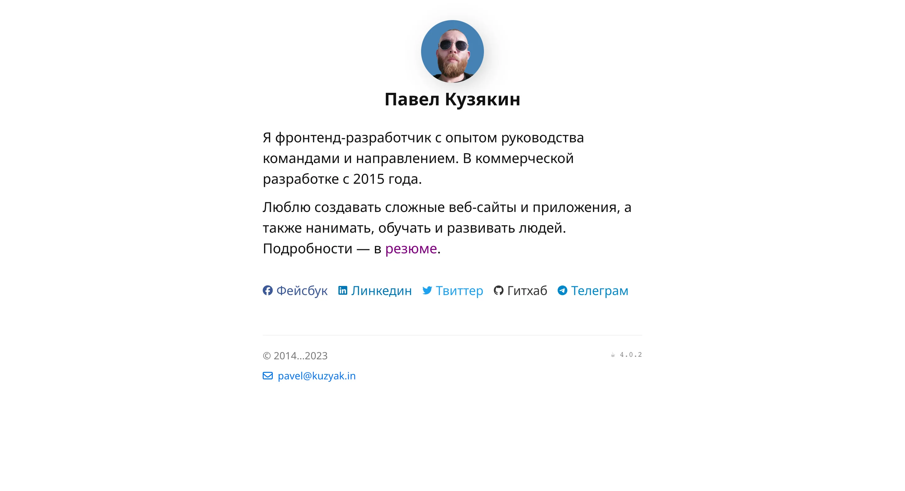

# <a href="https://kuzyak.in">kuzyak.in</a>

<a href="https://kuzyak.in"></a>

My personal website.

Made for myself, usually at night with an incredible amount of ☕.

This is a [Next.js](https://nextjs.org/) project bootstrapped with [`create-next-app`](https://github.com/vercel/next.js/tree/canary/packages/create-next-app).

## ✨ Why bother clicking

- It’s minimal — but not boring
- No Tailwind, no Bootstrap — just raw SCSS and care
- Fits all screens like a tailored suit
- Typography and whitespace? Obsessively crafted

## 🚀 Quick Start

```shell
$ git clone https://github.com/iposho/kuzyak.in.git
$ cd kuzyak.in/
$ npm i
$ npm run dev
```

## 🛠️ Stack & Tools

- [Next.js](https://nextjs.org/) - React framework
- [TypeScript](https://www.typescriptlang.org/) - Typed JavaScript
- [Sass](https://sass-lang.com/) - CSS preprocessor
- [ESLint](https://eslint.org/) - JavaScript/TypeScript linter
- [Stylelint](https://stylelint.io/) - CSS/SCSS linter
- [Husky](https://typicode.github.io/husky/) - Git hooks
- [Vercel Analytics](https://vercel.com/analytics) - Analytics
- [Vercel Speed Insights](https://vercel.com/speed-insights) - Performance monitoring

## 💻 Development Scripts

```shell
# Run in development mode
$ npm run dev

# Build for production
$ npm run build

# Run in production
$ npm run start

# Run linters
$ npm run lint
$ npm run stylelint

# Automatically fix issues
$ npm run lint:fix
```

## 📂 Project Structure

```
kuzyak.in/
├── public/          # Static files
├── src/             # Source code
│   ├── app/         # Next.js App Router
│   ├── components/  # React components
│   ├── styles/      # Styles
│   └── utils/       # Utilities
├── .husky/          # Git hooks
└── ...              # Configuration files
```

## 📦 Contribution
Contributions are welcome!

1. Fork the repository
2. Create your feature branch (`git checkout -b feature/amazing-feature`)
3. Commit your changes (`git commit -m 'Add some amazing feature'`)
4. Push to the branch (`git push origin feature/amazing-feature`)
5. Open a Pull Request

## 📝License

This project is licensed under the terms of the [MIT License](LICENSE).

<br/><br/>
<a href="https://web.archive.org/web/20010406054522/http://mir.glasnet.ru/~awicon/">
    
</a>
