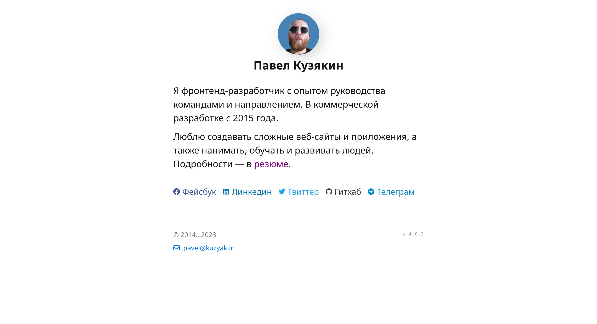

# kuzyak.in



Welcome to my personal website. Made for myself, usually at night with an incredible amount of ☕.

Production version is here: https://kuzyak.in.

## Technologies
    

## Getting started

```shell
$ git clone https://github.com/iposho/kuzyak.in.git
$ cd kuzyak.in/
$ npm i
[...]
$ npm run dev
```

## Contributions
If you have suggestions for improving the code or functionality, please create an issue or pull request.

## Licensing

This project is licensed under the terms of the [MIT License](LICENSE).
