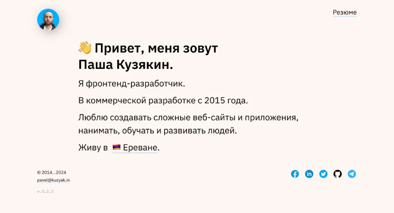

# <a href="https://kuzyak.in">kuzyak.in</a>

<a href="https://kuzyak.in"></a>

My personal website.

Made for myself, usually at night with an incredible amount of ☕.

## Installing / Getting started


```shell
$ git clone https://github.com/iposho/kuzyak.in.git
$ cd kuzyak.in/
$ npm i
$ echo "YANDEX_METRIKA_ID=YOUR_YANDEX_METRIKA_ID" >> .env.local
[...]
$ npm run dev
```

## Licensing

This project is licensed under the terms of the [MIT License](LICENSE).
