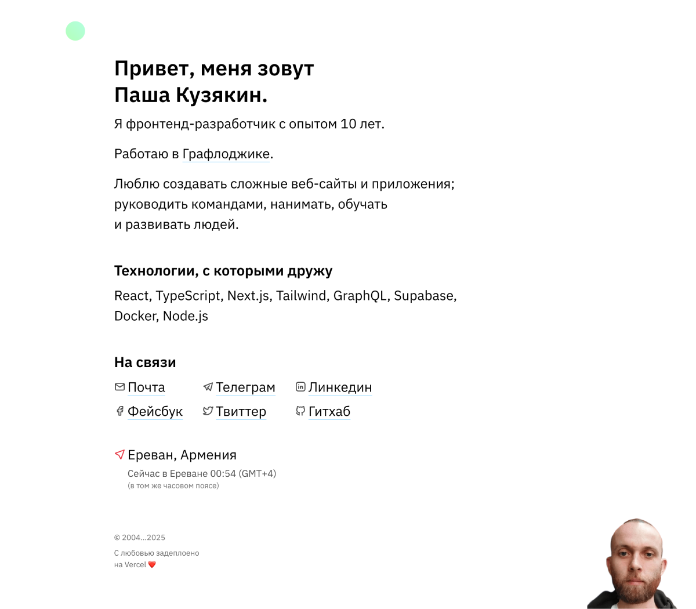

# <a href="https://kuzyak.in">kuzyak.in</a>

<a href="https://kuzyak.in"></a>

My personal website.

Made for myself, usually at night with an incredible amount of ☕.

This is a [Next.js](https://nextjs.org/) project bootstrapped with [`create-next-app`](https://github.com/vercel/next.js/tree/canary/packages/create-next-app).

## Installing / Getting started

```shell
$ git clone https://github.com/iposho/kuzyak.in.git
$ cd kuzyak.in/
$ npm i
$ echo "YANDEX_METRIKA_ID=YOUR_YANDEX_METRIKA_ID" >> .env.local
[...]
$ npm run dev
```

## Technologies and Tools

- [Next.js](https://nextjs.org/) - React framework
- [TypeScript](https://www.typescriptlang.org/) - Typed JavaScript
- [Sass](https://sass-lang.com/) - CSS preprocessor
- [ESLint](https://eslint.org/) - JavaScript/TypeScript linter
- [Stylelint](https://stylelint.io/) - CSS/SCSS linter
- [Husky](https://typicode.github.io/husky/) - Git hooks
- [Luxon](https://moment.github.io/luxon/) - Date handling
- [Vercel Analytics](https://vercel.com/analytics) - Analytics
- [Vercel Speed Insights](https://vercel.com/speed-insights) - Performance monitoring

## Available Scripts

```shell
# Run in development mode
$ npm run dev

# Build for production
$ npm run build

# Run in production
$ npm run start

# Run linters
$ npm run lint
$ npm run stylelint

# Automatically fix issues
$ npm run lint:fix
```

## Project Structure

```
kuzyak.in/
├── public/          # Static files
├── src/             # Source code
│   ├── app/         # Next.js App Router
│   ├── components/  # React components
│   └── styles/      # Styles
├── .husky/          # Git hooks
└── ...              # Configuration files
```

## Environment Variables

Create `.env.local` based on `.env.example`:

```shell
YANDEX_METRIKA_ID=your_metrika_id
```

## Development and Deployment

1. Fork the repository
2. Create your feature branch (`git checkout -b feature/amazing-feature`)
3. Commit your changes (`git commit -m 'Add some amazing feature'`)
4. Push to the branch (`git push origin feature/amazing-feature`)
5. Open a Pull Request

## Contributing

Contributions are welcome! If you have any ideas for improvements, feel free to create issues or pull requests.

## Licensing

This project is licensed under the terms of the [MIT License](LICENSE).

<br/><br/>

